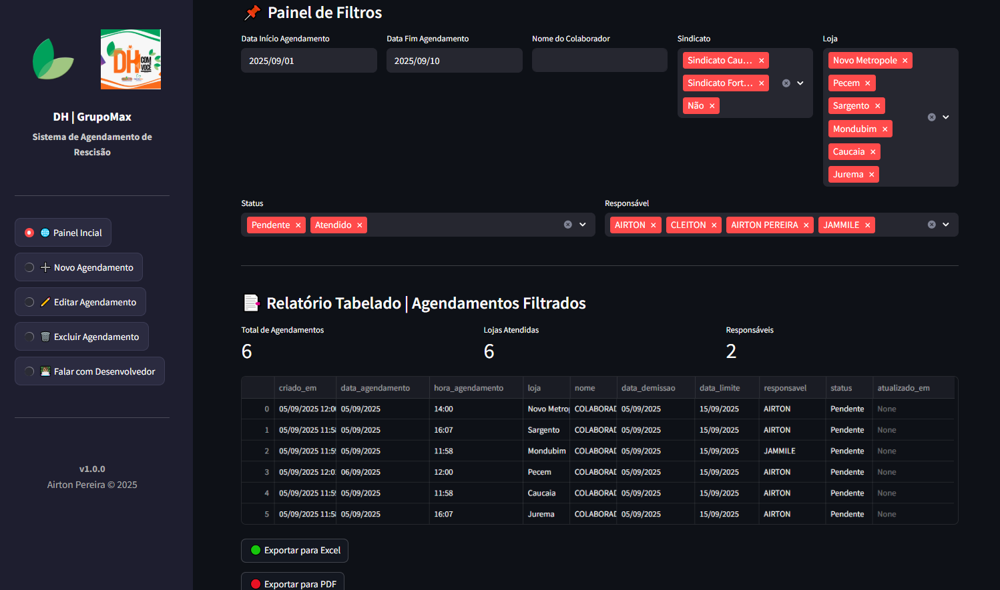
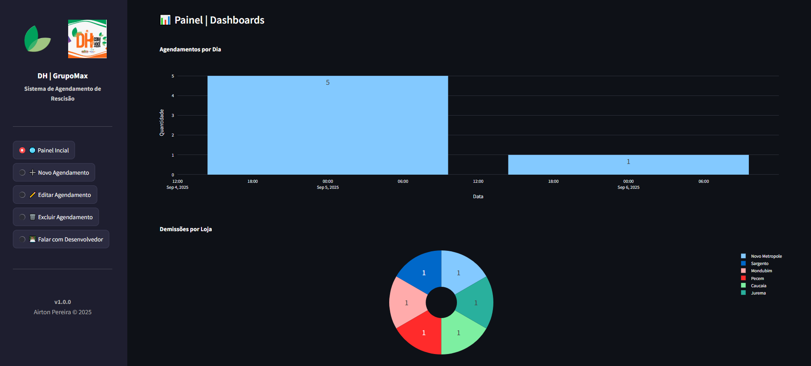
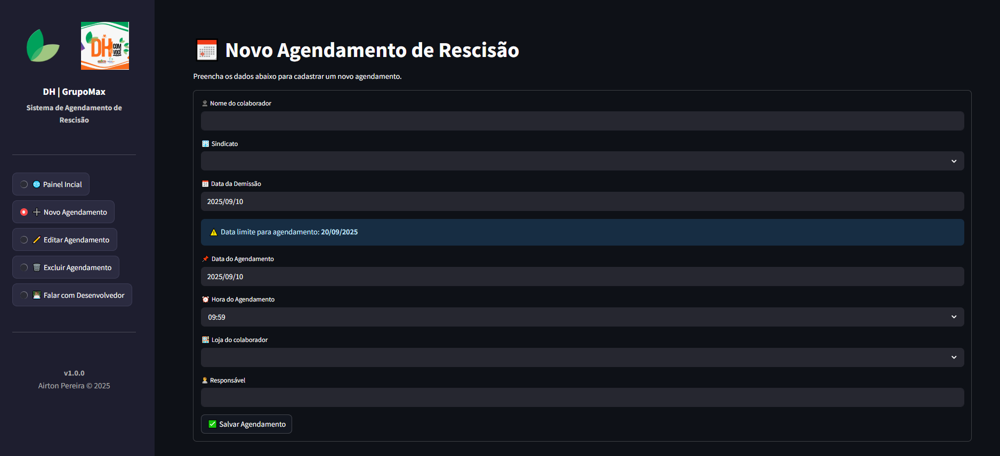
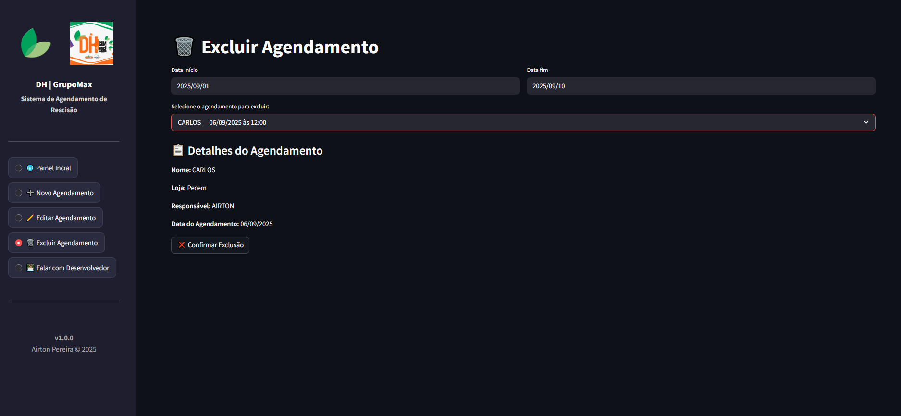
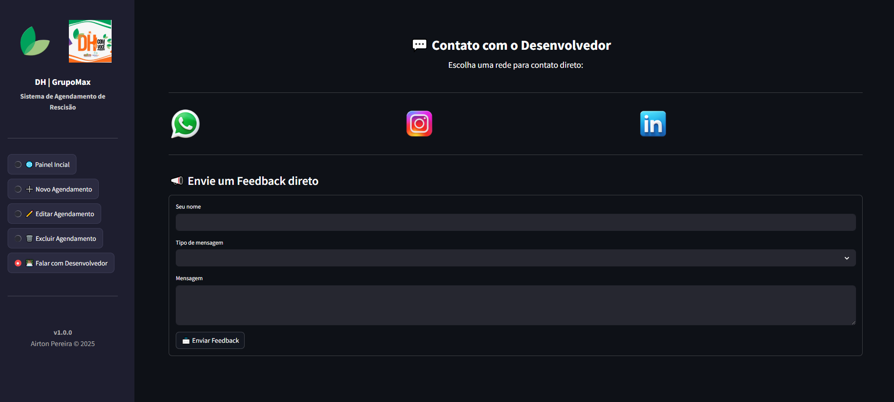

# 📋 Sistema de Controle de Rescisões — DH | GrupoMax

Aplicação web para gerenciamento de **agendamentos de rescisões**, desenvolvida em **Python + Streamlit**, integrada ao **Firebase** para persistência de dados.  
O sistema foi projetado para uso interno das equipes de **RH** e **DP**, além de gestores da área.

---

## 🚀 Funcionalidades Principais
- ✅ Cadastro de agendamentos de rescisão
- ✅ Edição, exclusão e visualização de registros
- ✅ Dashboard com indicadores
- ✅ Exportação de relatórios em **PDF** e **Excel**
- ✅ Envio de notificações por e-mail
- ✅ Tema escuro por padrão, com layout moderno e responsivo
- ✅ Logos e identidade visual personalizadas para a empresa

---

## 🖼️ Interface

Abaixo estão os principais painéis da interface do sistema:

---

## 🏗️ Estrutura do Projeto

agendamento_rescisao/
│
├── app.py # Arquivo principal (entrada da aplicação)
├── requirements.txt # Dependências
├── .env.example # Exemplo de variáveis de ambiente
├── .streamlit/ # Configurações do tema
│ └── config.toml
│
├── assets/ # Logos, CSS e ícones
│ ├── dh.png
│ ├── logo.png
│ └── styles.css
│
├── config/ # Configurações e credenciais
│ ├── firebase_config.py
│ ├── serviceAccountKey.json (IGNORADO no git)
│ └── settings.py
│
├── data/ # Camada de acesso a dados
│ ├── database.py
│ └── queries.py
│
├── utils/ # Funções auxiliares
│ └── email_utils.py
│
├── views/ # Telas / funcionalidades
│ ├── cadastro.py
│ ├── dashboard.py
│ ├── editar_agendamento.py
│ ├── excluir_agendamento.py
│ ├── gerar_pdf.py
│ ├── relatorios.py
│ └── visualizar_agendamentos.py
│
└── falar_desenvolvedor/ # Tela de contato/feedback
└── contato_dev.py

---

## ⚙️ Tecnologias Utilizadas
- [Python 3.11+](https://www.python.org/)
- [Streamlit](https://streamlit.io/)
- [Firebase Admin SDK](https://firebase.google.com/docs/admin/setup)
- [Pandas](https://pandas.pydata.org/)
- [ReportLab](https://www.reportlab.com/dev/)
- [OpenPyXL](https://openpyxl.readthedocs.io/en/stable/)
- [dotenv](https://pypi.org/project/python-dotenv/)

---

## 📦 Instalação Local

### 1. Clonar o repositório
git clone https://github.com/SEU_USUARIO/agendamento_rescisao.git
cd agendamento_rescisao
2. Criar ambiente virtual
Copiar código
python -m venv venv
source venv/bin/activate   # Linux/Mac
venv\Scripts\activate      # Windows
3. Instalar dependências
Copiar código
pip install -r requirements.txt
4. Configurar variáveis de ambiente
Crie um arquivo .env na raiz (baseado em .env.example) com:

Copiar código
FIREBASE_CREDENTIALS=config/serviceAccountKey.json
MAX_AGENDAMENTOS_DIA=5

SMTP_SERVER=smtp.gmail.com
SMTP_PORT=587
EMAIL_ORIGEM=seu_email@exemplo.com
SENHA_EMAIL=sua_senha_app
Coloque também o arquivo serviceAccountKey.json em config/ (não versionado).

5. Rodar aplicação localmente
Copiar código
streamlit run app.py
O sistema abrirá em http://localhost:8501.

### ☁️ Deploy no Render

1. Faça push do projeto para o GitHub
2. Acesse [Render](https://render.com) → *New Web Service*
3. Conecte ao repositório
4. Configure:
   - **Build Command**: `pip install -r requirements.txt`
   - **Start Command**: `streamlit run app.py --server.port 10000 --server.address 0.0.0.0`
5. Em *Environment Variables*, adicione:
   - `FIREBASE_CREDENTIALS`
   - `MAX_AGENDAMENTOS_DIA`
   - `SMTP_SERVER`
   - `SMTP_PORT`
   - `EMAIL_ORIGEM`
   - `SENHA_EMAIL`
6. Finalize o deploy e acesse a URL gerada (ex: `https://agendamento.onrender.com`)

🧑🏽‍💻 Desenvolvedor
Airton Pereira
📩 airtonpereiradev@gmail.com
💼 GitHub: AirtonP7

📌 Licença
Este projeto tem todos os direitos reservados ao desenvolvedor Airton Pereira.
Não é permitido uso ou redistribuição sem autorização prévia.
